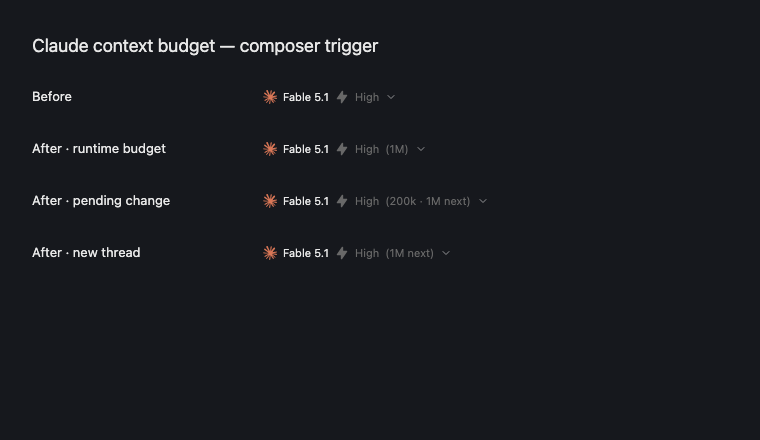

# Claude context selection patch

## Evidence and decision

The parent audit reproduced SDK 0.3.259 with Claude CLI 2.1.259 and 2.1.274 using isolated sessions and `getContextUsage({ detail: "summary" })`, without inference. Live `applyFlagSettings({ autoCompactWindow })` updates settings but leaves the runtime window unchanged: Auto reports 1,000,000 / 967,000; a new 200k spawn reports 200,000 / 167,000. Embedded CLI inspection found settings and `appState.autoCompactWindow` diverge. This does not verify compaction of a large real conversation.

Treat normalized auto-compact overrides as spawn-fixed, reusing the existing restart/resume path. Reject replacement while foreground, background, workflow, subagent, approval or question work remains, at the adapter's authoritative retirement boundary. Reject incompatible direct sends before mutation. Keep the applied selection cache unchanged on failure. Preserve live model-only, non-max effort, thinking and fast-mode changes.

## Scope and tests

- Shared model comparison: Auto/undefined equivalence, legacy options, invalid values, every 200k/1M/Auto transition and unchanged selections.
- Adapter and orchestration: unchanged resume identity/counters, active-work replacement rejection, direct-send rejection, existing live controls and cold-context preflight.
- UI: runtime usage denominator and percentage stay together; configuration events identify the applied mode, including Auto. Old usage must not confirm a new configuration; preserve compaction invalidation.
- Add regression tests before production changes and an opt-in isolated native summary probe. Finish with focused tests, formatting, lint, typecheck and the workspace test suite. Lifecycle preparation changes retirement ordering; include `bun run windows-runtime:check`. Packaged Windows execution remains unverified.
- Update provider documentation; leave all work local in this worktree, without commits or publication.

## Sources

This patch reuses Synara's existing spawn-profile boundary and leaves cache ownership with Claude.

Related Claude reports from the parent audit: [#78318](https://github.com/anthropics/claude-code/issues/78318) is related but its stale closure is not a fix, [#93901](https://github.com/anthropics/claude-code/issues/93901) concerns the ring, and [#78720](https://github.com/anthropics/claude-code/issues/78720) concerns resume cache misses on 2.1.263. No exact live-setting fix was found through 2.1.274. These are parent-audit observations, not newly verified upstream status.

Reference contracts: [context and auto-compaction](https://code.claude.com/docs/en/model-config#context-window-and-auto-compaction), [prompt caching](https://code.claude.com/docs/en/prompt-caching), [SDK configuration](https://code.claude.com/docs/en/agent-sdk/configuration).

## Limits

The selected target is not the effective threshold: output reserves, environment settings and model caps can change runtime reporting. Never test application by equating threshold with nominal target. Resuming preserves conversation identity but does not guarantee a cache hit. Keep provider-owned cache observations and counters, and the existing large cold-context preflight. Do not broaden `snapshot`: with `systemPrompt.append`, omitted snapshot disables prompt recording by default, while enabling it can freeze appended instructions on resume and needs separate evaluation. No custom cache, TTL, global environment changes, user-setting writes, migrations or paid inference.

## Native resume evidence supplied during implementation

The independently produced report was inspected at
`/var/folders/14/rtp60871279g271xwzx2qrpc0000gn/T/synara-claude-resume-1m-check-4i5l2d/report.json`.
SDK 0.3.259 / CLI 2.1.274 used fixed model `claude-fable-5-1[1m]` and native UUID
`143080a7-53c4-446a-a3b7-dedfef21f713` across four processes: initial 200k reported
200000/167000, resume 1M 1000000/967000, resume 200k 200000/167000 and resume Auto
1000000/967000. The local `/context` command persisted a real transcript with linked
parent UUIDs. All process exits were 0; all result model turns, token usage and costs were 0.
A fake credential and rejecting loopback endpoint isolated requests (hello/count_tokens only,
no inference). The model suffix stayed constant because bare models on the custom endpoint
had a 200k capability. This proves settings can change on resume, not cache hits or actual
large-context compaction. No additional model requests were made for this patch.

## Safety refinements from review

Preparation runs under the service lifecycle lock before publishing a new generation. Claude
checks runtime work and retires under its own lifecycle lock; events retain their old owner until
retirement succeeds. Direct adapter replacement repeats the guard. Persistent TODOs are excluded
from replacement eligibility but remain part of the unchanged compaction guard. A refused steer
preserves the live projected turn; a refused normal send restores only its own optimistic starting
state using an expected-session check. Adapter and shared option normalization both honor blank
modern values with a valid legacy fallback. Missing configuration history leaves the target unknown.

The opt-in `bun apps/server/scripts/claude-context-window-probe.mjs --run /absolute/path/to/claude`
uses only summary controls, isolated HOME/config/cwd, no tools/MCP/hooks, fake credentials and a
rejecting loopback endpoint. Executed here against `/opt/homebrew/bin/claude` 2.1.274: Auto stayed
1000000/967000 after live 200k, pinned 200k stayed 200000/167000 after live 1M. Only two `/api/hello`
requests reached loopback, with no count-token or inference requests. It complements the independent
real-transcript resume report above; it is intentionally excluded from the automatic test suite.

Auto permission-mode preflight resolves the effective persisted/explicit provider options and
validates CLI version/binary before retirement, with the old generation still current. The adapter
rechecks runtime work after the asynchronous probe. Its prepared start retains env/snapshot support
only in a per-attempt closure, so a second probe cannot fail after the old session was stopped.
The existing snapshot policy is unchanged. Tests cover unsupported 2.1.110, probe failure,
late background work, preserved event routing, and exactly one successful probe per replacement.

## Final verification (2026-09-17)

All work remains in `db11b9ba36e6`, branch `synara/claude-context-switch-safety`, without commits or publication. Production changes are limited to shared model normalization, Claude adapter preparation/dispatch, provider service/coordinator retirement ordering, reactor selection/error projection, and contextWindow/ChatView reporting. Provider documentation, focused regressions, a browser tooltip test and the opt-in native probe accompany them.

| Check                                            | Final result                                                                         | Local evidence                               |
| ------------------------------------------------ | ------------------------------------------------------------------------------------ | -------------------------------------------- |
| `bun run test` with Node 24.13.1                 | 7 tasks successful; 11,828 tests passed, 30 skipped; server 5,248 passed, 20 skipped | `/tmp/db11-final-stable-node24-test.log`     |
| Final adapter/service/coordinator/reactor suites | 668 passed                                                                           | `/tmp/db11-final-affected.log`               |
| Context meter and compaction browser tests       | 17 passed                                                                            | `/tmp/db11-final-browser.log`                |
| `bun run typecheck`                              | 7 tasks successful                                                                   | `/tmp/db11-final-typecheck5.log`             |
| `bun run lint`                                   | 0 errors, 568 warnings                                                               | `/tmp/db11-final-lint4.log`                  |
| `bun run fmt:check`                              | Passed, including this final report update                                           | `/tmp/db11-final-fmt-check5.log`             |
| `bun run windows-runtime:check`                  | Passed across 242 application source files                                           | `/tmp/db11-final-windows-runtime-check2.log` |
| Native control-only probe                        | Live settings stale; fresh spawn setting effective; hello requests only              | `/tmp/db11-native-control.log`               |

The definitive workspace run started at 23:26:32 and completed in 5m39s after the final preflight closure change. The tracked diff stayed unchanged throughout (SHA-256 `a265756cbcccd9a9bc058763ba8ff43ff31a2c774ded107a400389309dcf17d1`). Initial regression tests reproduced the missing restart and mixed UI denominator before their fixes. An earlier workspace run using ambient Node 26.8.1 failed 32 localStorage tests in four unchanged store files; the required Node 24.13.1 passed all 35 tests in those files and the complete workspace suite. No unrelated store changes were made.

Native evidence is macOS-only. Packaged Windows behavior, signed artifacts, actual huge-context compaction and cache hits remain unverified. Snapshot policy, cache ownership and cold-context confirmation are unchanged. No production instance, main branch or other worktree was modified.

## Composer suffix follow-up (2026-09-18)

UI-only scope: reuse the picker/trigger with a separate context suffix, leaving trait status labels,
server lifecycle, cache and snapshot policy unchanged. Show name + effort + observed budget;
use the existing threshold-to-budget heuristic only for runtime reporting whose observed Claude
model matches the selected model (normalizing the API context suffix). Auto is a target, not a
budget: Auto plus runtime 967k can show `(1M)` without becoming pending. Explicit choices without
matching evidence remain visible as `next`; an unknown budget with a matching applied target is
labeled `target`. Pending changes retain the current observed budget and name the next choice.
The footer's width invalidation includes the suffix; compact mode uses the existing title/sr-only
pattern. Tests cover caps, stale/absent model provenance, Auto, new threads, other providers, real
picker button text and compact width. No new native probe or server/full-workspace rerun is needed.

Follow-up verification with Node 24.13.1: 46 relevant web unit tests passed
(`/tmp/db11-ui-unit-final.log`); 16 Chromium tests passed using `bun run test:browser:stable`
(`/tmp/db11-ui-browser-verified.log`). The real picker renders Fable 5.1 High (1M), Opus High (1M)
(the existing default effort is preserved), pending/new-thread suffixes, and compact title/text
with button width below 150px. Runtime API `[1m]` suffix matching is covered through the helper
and rendered picker. `bun run typecheck` passed all 7 tasks (`/tmp/db11-ui-typecheck.log`);
`bun run lint` reports 0 errors and the existing 568 warnings (`/tmp/db11-ui-lint.log`).
Formatting and `git diff --check` pass. An initial browser assertion expected no default Opus
effort; the fixture was corrected to preserve existing High behavior. The parallel browser
attempt did not provide a passing result; the final serial stable harness completed both files.
The previous complete workspace/native/Windows checks above belong to the underlying patch;
this UI-only follow-up does not claim to rerun them.

## Pre-PR review (2026-09-18)

The subsequent check-code review traced the normalized selection through reactor, lifecycle
preparation, adapter retirement and dispatch, then checked runtime/configuration provenance in
the composer. No additional actionable defects or worthwhile structural refactors were found.

The image renders the actual trigger component: the before row omits its new suffix prop.
It is a browser component comparison, not a packaged-app or native Claude validation.
